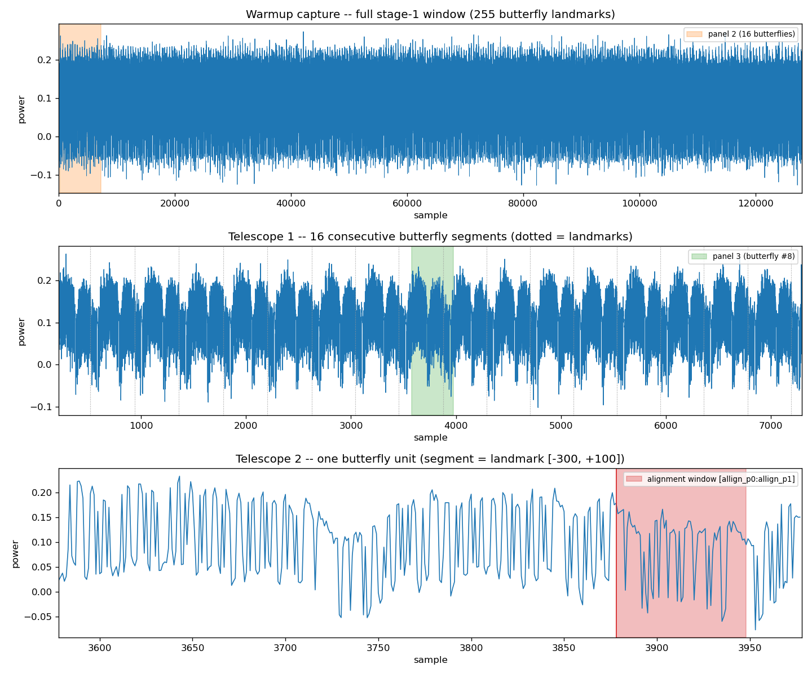
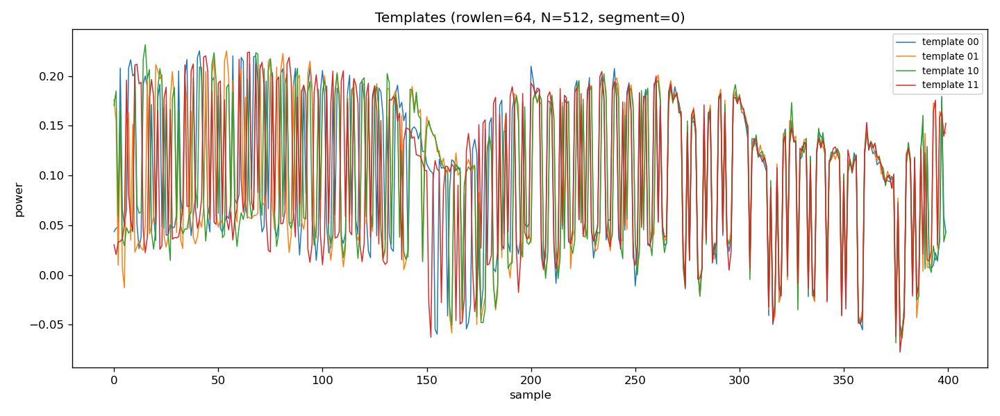

# Toeplitz/FFT Privacy Amplification — Template Attack (CW312)

A profiled (template) side-channel attack that recovers the secret **key**
input to a seeded Toeplitz/FFT privacy-amplification hash running on a
ChipWhisperer **CW312 / SAM4S** target.

The attack targets **stage 1 of the key FFT**. That stage is a sequence of
radix-2 butterflies, each mixing one pair of input bits. Every butterfly's
power signature depends only on its two input bits (4 possibilities:
`00 01 10 11`), so one template per class is enough to read the key back
two bits at a time.

---

## Repository layout

```
scripts/
  toeplitz_fft_controller.py   host <-> firmware comms + a numpy reference; standalone CLI to verify the firmware
  tools.py                     capture / segmentation / template / attack-scoring library (class Tools)
  template_attack.py           the attack driver — CLI with `profile` and `attack` subcommands
src/privacy_amplification/FFT/
  Toeplitz_FFT.c               the firmware
  makefile                     builds Toeplitz_FFT-ROWLEN<n>-CW312_SAM4S.hex
  gen_twiddle_table.py         regenerates twiddle_table.h for a given ROWLEN (run by the makefile)
results/                       captured traces, templates, plots (git-ignored)
docs/                          committed figures embedded in this README
```

## Requirements

- A ChipWhisperer capture board + CW312/SAM4S target, with the
  `chipwhisperer` Python package installed and importable.
- Python 3.10+ (the code uses `match`), `numpy`, `matplotlib`.
- An ARM toolchain (`arm-none-eabi-gcc`) to (re)build the firmware.

---

## 1. Build & flash the firmware

There is **one** firmware build. It computes the full seeded hash
(key FFT → seed FFT → pointwise multiply → IFFT → mod 2) so its result can
be checked, and only **stage 1 of the key FFT** is wrapped by the CW
trigger, so the same binary is what power traces are captured from.

Per iteration the device speaks a raw binary protocol over the CW UART.
Each exchange is a one-byte command followed by its payload:

```
host -> 'k' + key      target -> key echo
host -> 's' + seed     target -> seed echo
host -> 'g'            target -> result   (hash of the loaded key + seed)
```

Splitting the load and run steps lets a capture be armed after both slow
transfers and before the one-byte `'g'`, so the trigger fires right after
`scope.arm()`.

`ROWLEN` is the key/seed size **in bytes**; `ROWLEN*8` must be a power of
two. It must match on both sides — the makefile and the Python scripts
both default to **64** (a 512-bit hash); override with `ROWLEN=` to `make`
and `--rowlen` to the scripts together.

```bash
cd src/privacy_amplification/FFT
make clean && make               # -> Toeplitz_FFT-ROWLEN64-CW312_SAM4S.hex
make clean && make ROWLEN=128     # -> Toeplitz_FFT-ROWLEN128-CW312_SAM4S.hex
```

> `make clean` before a rebuild with a different `ROWLEN` is required — the
> object dir is keyed only on `PLATFORM`, so a stale rebuild would silently
> keep objects from the previous `ROWLEN`.

The Python code flashes the matching `.hex` for you (see
`toeplitz_fft_controller.connect()` / `hex_path()`), so you normally only
need to *build* it, not flash it by hand.

## 2. (Optional) Verify the firmware is correct

```bash
python scripts/toeplitz_fft_controller.py --rowlen 64 --trials 10
```

Runs random key/seed pairs through the device and checks each result
against the numpy reference (`reference_hash`). Exit status is 0 iff every
trial matched with no unresolved UART desyncs. 

---

## 3. Profile — build the templates

```bash
# (a) Capture fresh raw traces from the ChipWhisperer, then build templates:
python scripts/template_attack.py --rowlen 16 profile --online

# (b) Rebuild templates from a previously captured raw-trace .npz — no hardware:
python scripts/template_attack.py --rowlen 16 profile
```

Options: `--repeats N` (traces averaged per class, default 3). `--rowlen`
and `--results-dir` are global — put them *before* the subcommand.

Writes to `results/` (names shown for `--rowlen 16`):

| File | Written by | Contents |
|------|-----------|----------|
| `raw_traces_rowlen16.npz` / `.png` | `--online` only | every pre-segmentation capture (warmup + 4 classes × repeats) |
| `warmup_telescope_rowlen16.png` | `--online` only | 3-level telescopic view of the warmup (also copied to `docs/warmup_telescope.png`) |
| `templates_rowlen16.npz` / `.png` | always | the 4 per-butterfly mean templates `(4, n_seg, seg_len)` + metadata |
| `aligment_trace.npy` | always | the alignment reference window every later capture is segmented against |

Splitting capture (`--online`) from template-building lets you iterate on
segmentation / averaging offline against a fixed raw-trace set.

## Trace anatomy — telescopic view of the warmup

Every `profile --online` run (`save_raw_traces(..., plot=True)`) also writes
a three-panel telescopic view of the warmup capture,
`docs/warmup_telescope.png` — each panel expands the shaded slice of the one
above it:



- **Top — the whole trigger window.** One `'g'` runs the full hash, but the
  CW trigger is held high only for **stage 1 of the key FFT**: `N/2` radix-2
  butterflies (255 landmarks at `ROWLEN=64`, `N=512`) back-to-back in a
  single ~128 k-sample trace.
- **Middle — 16 consecutive butterfly segments.** The periodicity resolves
  into one repeating unit per butterfly. Dotted lines are the landmarks
  `
- **Bottom — one butterfly unit.** This 400-sample window (`window_below=300`
  before the landmark, `window_above=100` after) is exactly one segment the
  segmenter emits, one row of a template, and one window
  `run_profiled_attack()` scores by SAD. The red band is the alignment
  window itself. The aligment window is a common section of power trace that follows all but the last butterfly operations. When viewing the templates it is the overlapping section that corresponds to this allignment window.

**Segmentation** The `sliding_window_segmenter()` finds: it slides a         70-sample reference
  (`allign_p0:allign_p1`, lifted from the first butterfly) across the whole
  trace and marks every position where the SAD falls below `sad_thresh`.
  One landmark per butterfly ⇒ `N/2 − 1` segments (the last runs off the end meaning we do not actually attack the last 2 butterfly bits).



**Butterfly Templates** Each of the `N/2 -1` segments has 4 templates at the end of the profiling phase. There is slight permutation between the power traces of different butterfly operations so a segment wise templating strategy is more robust than 4 generic templates. The begining of the templates is data dependant, while the later portion is not and is constant. We use this as the alignment region between templates and trace segments.

## 4. Attack — recover keys

```bash
python scripts/template_attack.py --rowlen 16 attack --tests 20
```

Loads the saved templates + alignment reference (no re-profiling), then
for each random key: captures a target trace, segments it, and scores
every butterfly against the 4 templates by **SAD** (lowest wins → that
butterfly's two key bits). Prints `Correct key bits: c/N` per test;
**exit status is 0 iff every test recovered the full key**.

Both functions are importable for notebook / REPL use:

```python
import template_attack as ta
ta.profile(rowlen=16, repeats=5)          # -> templates .npz path
ok = ta.attack(rowlen=16, tests=10)       # -> bool
```

---

## Tuning notes

- **Capture window** — `Tools.configure_scope(samples=, offset=, gain=,
  adc_mul=)` must be wide enough to hold *all* `ROWLEN*4` stage-1
  butterflies under one trigger. If a capture is clipped,
  `sliding_window_segmenter()` finds fewer than `N//2 - 1` segments and
  asserts. Compare the `Trig count:` print against `samples`.
- **Segmentation landmarks** — `allign_p0` / `allign_p1` (module constants
  in `tools.py`) and `sad_thresh` / `window_below` / `window_above` inside
  `sliding_window_segmenter()` are measured for this hardware + `ROWLEN`.
  Re-measure against a real trace if you change the setup.
- **Clock hiccups** — changing `adc_mul` can unlock the ADC PLL
  (`CLKGEN Failed to load divider value` spam). `configure_scope()` calls
  `scope.clock.reset_adc()`; `Tools.reset_target()` recovers the target
  side.
- **RAM ceiling** — a larger `ROWLEN` needs more target RAM. The default
  is 64 bytes; see the header docstring of `toeplitz_fft_controller.py`
  for the tested limits (128 bytes comfortable, 256 tight, 512+ fails to
  link).
